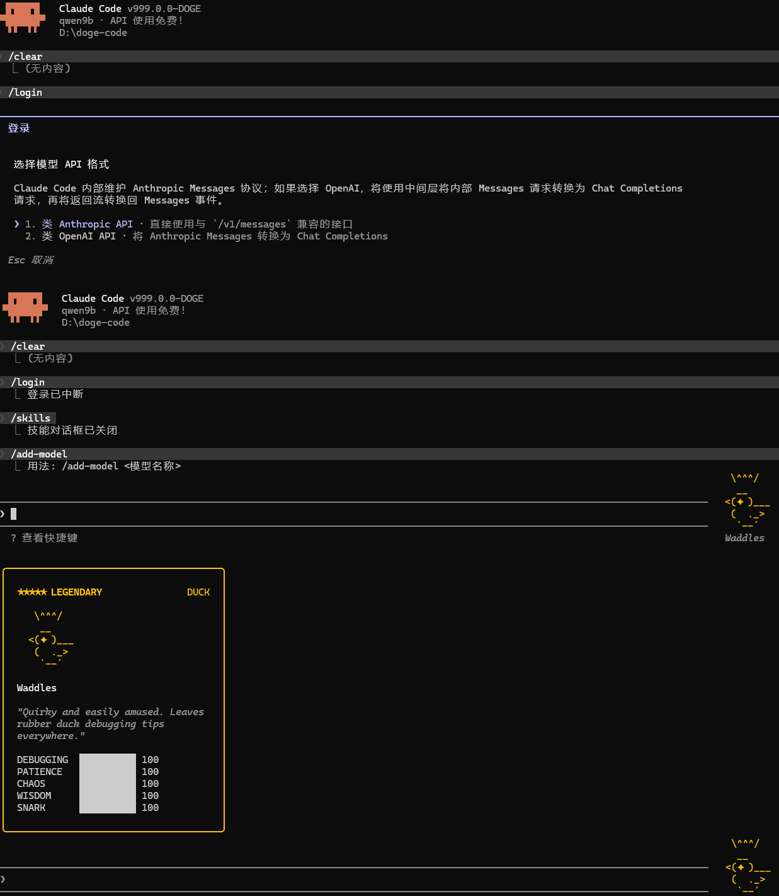

# Doge Code

> Claude Code 分支克隆后，不断试错，不断回退，逐步汉化，还在进行中的一个项目。纯粹就是为了好用，贴地好用。

[](README.md)
[](README.md)
[](README.md)
[](README.md)
[](README.md)
[](README.md)



## 这是什么

[`Doge Code`](README.md) 基于一份还原后的 [`Claude Code`](README.md) 源码树继续修改而来。

可以把它理解为：
  缝合怪+汉化版。
  
## 主要记录：
1、破除限制：官方对订阅用户有很多特权，通讯交流时无延迟，MPC支持，对兼容方式和非官方订阅都有很多限制，破除。
2、汉化：很多文件都通过2026年4月份放开试用的QWen Coder进行汉化，保证基本汉化质量，对于后续汉化不彻底的地方试用DeepSeek官方网页进行汉化。
3、定制：代码对状态栏进行了扩展，token进出已进行严密监控。
4、模型切换：自由切换不同厂家大模型的baseURL及APIKEY以及模型等，按照项目文件夹进行记录，低级项目试用普通本地部署，关键步骤试用云端。
5、可编译为可执行程序，方便切换到其他平台。
6、作者实际使用，并不断改进种，有使用问题及空闲时间，可参数本项目。
7、技能等开源内容，官方升级后，本系统也将升级，吸收官方可采纳的优秀功能。
8、由于可以直接使用链接，因此不再依赖ccswitch造成无谓的时间浪费和CPU算力消耗。
9、伙伴系统也移植到了系统，满级，满属性，稀有。
10、提示词全中文后，进行了精简，一连串没有意义的废话，发送一次请求包就要10K起步。中文提示词配合中文模型编程效率翻倍。
11、任务结束时，声音提醒，官方暂无此功能。


## 使用心得：
1、一个请求处理完毕后，没必要再继续时，/clear重新会话，减少上下文，清洗大模型脑子。
2、使用遇到大模型逼逼叨叨反反复复的情况，中断任务，新开会话。
3、复杂事务处理应分阶段，分难度，子代理功能官方有问题，已修复。
4、没事别和大模型絮叨或者你好啥的，它就是没有灵魂的数字。
5、提示词精准，切中要害，多用限制词：必须、一定，务必这种。
6、将稍微复杂的事务处理完毕后，可以考虑叫大模型总结一个技能。
7、即时在状态栏查看token消耗。
8、及时禁用、启用插件，清理没用的技能，及时提交项目至云端，方便回溯。
9、首次提交到github.com时，务必记得忽略规则文件中将.doge/目录排除，以防APIKEY公布。


## 常用命令：
/login 切换不同BaseURL，APIKEY,模型。
/clear 清空上下文，相当于退出软件再进入
/plugins 管理插件
/skills 管理技能
/agents 管理代理
/compact 压缩会话内容，减少token消耗。
/context 查看上下文用量
/rewind 或者两次ESC,相当于上下文回滚到指定轮次。
/resume 恢复选定的会话。
/rename 命名会话方便记忆。
/model 切换当前使用的模型为新模型
/cost 计费情况查看，待完善。
/plan 或者Shift+Tab 两次进入计划模式。
/init 重新审视项目，更新CLAUDE.md文件。


如果用 ACG 比喻，大概属于：

- 原作：[`Claude Code`](README.md)
- 本作：[`Doge Code`](README.md)

## 当前定位

这个仓库当前强调的是以下方向：

- 支持自定义 Anthropic 兼容接口地址
- 已经加入多入口的 OpenAI Chat Completions ↔ Anthropic Messages 转接能力
- 支持自定义 API Key
- 支持自定义模型与模型列表管理
- 尽量把自定义接入数据记录到项目下[`./.doge`](README.md) 路径体系
- 在保留 CLI/TUI 主体结构的前提下，无视登录流的绑定

换句话说，它现在更像一个“可自托管 / 可代理 / 可转接”的 [`Claude Code`](README.md) 变体。

## 与原版 Claude Code 的数据隔离

[`Doge Code`](README.md) 默认**不应**与原版 [`Claude Code`](README.md) 共用配置和缓存目录。

当前 Fork 已明确把默认用户目录收口到：

- 配置目录：[`~/.doge`](README.md)
- 全局配置文件：[`~/.doge/.claude.json`](README.md)
部分配置依旧使用官方的配置。

如果用户以前装过原版 [`Claude Code`](README.md)，再运行 [`Doge Code`](README.md) 时出现“明明没这么配却读到了旧配置”的现象，通常就是历史数据混用导致的。

建议：

- 原版继续使用它自己的 [`.claude`](README.md) / [`.claude.json`](README.md)
- [`Doge Code`](README.md) 使用 [`.doge`](README.md) 目录
- 如需手动指定，也可以通过 [`CLAUDE_CONFIG_DIR`](README.md) 为 [`Doge Code`](README.md) 指向独立目录

## OpenAI 兼容接口说明

[`Doge Code`](README.md) 正在加入一个“中间转接层”模式，用来让内部仍按 Anthropic Messages 结构工作的主逻辑，转发到 OpenAI Chat Completions 接口。

## 和原始还原仓库的关系

这个仓库**不是**上游官方源码Claude Code。

它有两层历史：

1. 第一层：还原后的源码树
2. 第二层：基于该源码树继续进行的 Fork 魔改
3、本项目：跟踪并吸纳官方闭源有用功能。

## 自动同步上游

仓库现在按 **Fork 常规同步** 的方式自动跟进上游，而不是把 [`main`](README.md) 做成裸镜像。

默认目标：

- 上游仓库：`https://github.com/HELPMEEADICE/doge-code.git`   截至今日已28天未更新，也就是从未更新。
- 上游分支：`main`
- 本仓库目标分支：`main`

如果你希望调整仓库或分支，可在 GitHub 仓库 Variables 里设置：

- `UPSTREAM_URL`
- `UPSTREAM_BRANCH`
- `TARGET_BRANCH`

注意：

- 这属于 Fork 常规同步，不会主动抹掉仓库里额外保留的工作流、脚本和发布配置
- 如果上游改动与你的 Fork 改动产生真实冲突，工作流会失败，需手动处理
- 仓库需要允许 Actions 具备 `contents: write` 权限，否则工作流无法推送
- 如果你以后要改成追更更上层仓库，例如 `anthropics/claude-code`，只需要改 `UPSTREAM_URL`

## 自动发布 npm

仓库现在也支持在同步成功后，基于当前 [`main`](README.md) 自动打包并发布你自己的 npm 包。

发布方式：

- 工作流：[`publish-npm.yml`](.github/workflows/publish-npm.yml)
- 打包脚本：[`prepare-release-package.mjs`](scripts/release/prepare-release-package.mjs)
- 启动包装器：[`claudex.js`](scripts/release/bin/claudex.js)

发布行为：

- 工作流在“同步上游”成功后触发，也支持手动触发
- 先准备一个专门用于发布的 `dist/npm/` 目录
- 把 `src`、`shims`、`vendor`、启动包装器以及发布所需元数据复制进去
- 发布版本号会基于源码里的版本号，再拼接当前提交短 SHA
- 同一提交只会发布一次，已存在的版本会自动跳过

 

可在 GitHub 仓库 Variables 里覆盖：

- `NPM_PACKAGE_NAME`
- `NPM_BIN_NAME`
- `PUBLISH_REPOSITORY_URL`

发布前提：

- 推荐在 npm 侧为这个仓库配置 Trusted Publishing；当前工作流已支持无 `NPM_TOKEN` 时自动走这条路径
- 如果你仍然想走传统 token，也可以配置 `NPM_TOKEN`
- 这个发布包是 “npm 分发 + Bun 运行” 模式，用户机器上仍需安装 Bun

安装与使用：

```windows cmd 中执行
install.bat     
complie.bat 
```
启动命令：d.bat  内有环境变量，自行设置。
如果编译有问题，可自行下载依赖包，或者留言。


## 当前状态

- 该源码树已经可以在本地开发流程中恢复并运行
- [`bun install`](README.md) 可用于安装依赖
- [`bun run dev`](README.md) 可用于启动恢复后的 CLI/TUI
- [`bun run version`](README.md) 可用于输出当前版本信息
- 项目已被继续改造成 [`Doge Code`](README.md) 分支，部分行为和 UI 已不再与原始 Claude Code 一致
- 部分区域仍保留恢复期 fallback，因此行为可能与上游实现不同
- OpenAI API 格式转接功能仍在开发中，当前并非完全稳定

## 为什么会有这个仓库
1、上游停止更新
2、基本没有中文编程沟通环境，中文严谨、单token携带的信息密度更高，可以在日常使用中节约更多token。
3、Claude Code对华政策令人不齿。
4、后续可能的情况下，脱离官方SDK支持。


## 运行方式

环境要求：

- Bun 1.3.5 或更高版本
- Node.js 24 或更高版本

安装依赖：

```bash
bun install
```

## 快速安装（推荐开发者直接源码使用）

如果你是直接拉这个仓库源码来用，最快的方式是用 安装依赖，编译成exe，复制或者设置PATH成为全局命令。

### 方式：源码目录内直接注册

在仓库根目录执行：

```bash
bun install
bun link
```

注册成功后：

- 全局包名是 [`@doge-code/cli`](package.json:2)
- 命令名是 [`doge`](package.json:24)

此后可直接运行，加入PATH环境变量后，配合每个项目的记录文件可以做到随意自由使用。

```bash
doge
```


## 使用 Git 直接源码级更新

这个 Fork 很适合直接通过 Git 拉取更新，而不是走传统已发布包升级。

典型更新流程：

```bash
git pull
bun install
bun link
```
由于对linux支持度降低，未做测试，请见谅。

含义分别是：

- [`git pull`](README.md)：拉取最新源码改动
- [`bun install`](README.md)：同步依赖变化
- [`bun link`](README.md)：刷新全局 link 注册，确保命令入口与当前源码一致

如果你本地就是长期用源码目录跑 [`Doge Code`](README.md)，这基本就是“源码级更新”的标准姿势。

### 一个推荐工作流

首次安装：

```bash
git clone <your-fork-or-repo-url>
cd doge-code
bun install
bun link
doge
```
或者  git clone <your-fork-or-repo-url>
cd doge-code
install.bat
complie.bat
d.bat

启动后设置环境变量，仔细利用大模型对代码进行改造。
也可复制doge到环境变量指向的任意位置后，使用doge 运行。


后续更新：

```bash
git pull
bun install
bun link
doge
```

## 命令与包名

运行 [`Doge Code`](README.md) CLI：

```bash
bun run dev
```

安装为全局命令后，默认命令名为：

```bash
doge
```

也就是说，这个 Fork 现在的目标入口名是 [`doge`](README.md)，而不是 [`claude`](README.md)。

如果你使用 [`bun link`](README.md) 进行全局注册链接，那么现在注册出来的包名也不再是原版名，而是：

```bash
@doge-code/cli
```

输出版本号：

```bash
bun run version
```

## 说明与免责声明

- 本仓库是 [`Claude Code`](README.md) 的 Fork：[`Doge Code`]的再次分叉。(README.md)
- 它包含恢复期代码与后续 Fork 改动，不代表官方立场
- 如果某些行为看起来“很像官方，但又不完全像”，那通常不是你看错了，而是这确实是恢复版 + 魔改版的叠加态 
